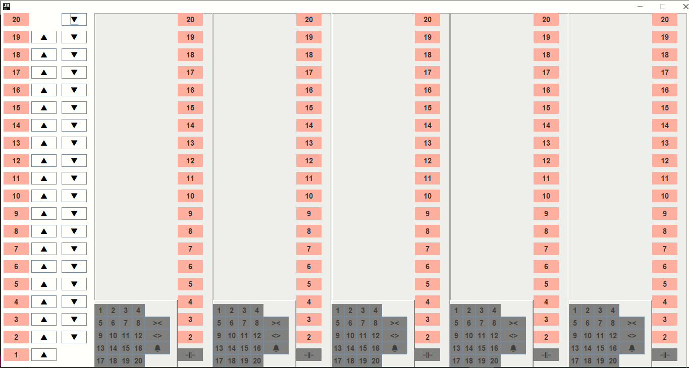
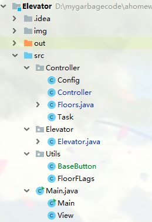
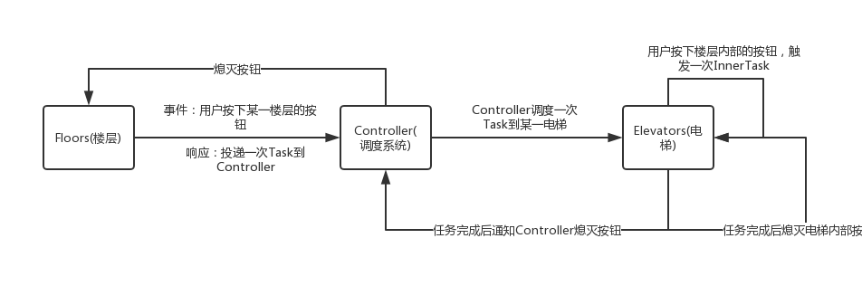
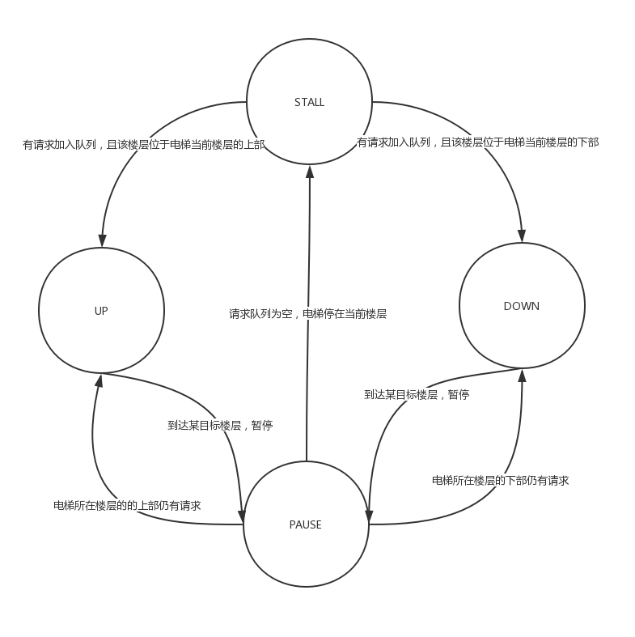

# Elevator Simulator(电梯调度系统)

> 施程航 1651162

## 需求

- 学习调度算法
- 通过实现电梯调度，体会操作系统调度过程
- 学习特定环境下多线程编程方法

## Overview



**楼层**：  
左侧为楼层按钮，这里没有做成五个电梯均拥有楼层按钮而是做成一个，主要是因为空间不足。其实做成五个楼层和一个楼层区别不是很大，只要把五个楼层按钮的`Listener`都绑定到同一个函数上，并在该函数中依次点亮所有同楼层的相同方向按钮即可。  
**电梯**：  
右侧为五部电梯，每个电梯都有整齐排列的内部按钮，包括数字、开关门和警铃按钮。可以看到，电梯初始时位于一楼。

开关门：  

```java
    //点击开门后在一段时间后会自动关门
    private void openDoorThenClose(){
        if(state!=EleState.STALL && state != EleState.PAUSE)return;
        openDoor();
        try {
            sleep(800);//停下来
        }catch (InterruptedException e){}
        closeDoor();
        try {
            sleep(300);//停下来
        }catch (InterruptedException e){}
    }

    //关门
    private void closeDoor(){
        curPos.setText(" =||= ");
    }
```

按下报警按钮电梯会闪烁：

```java
//报警
    private void alert() {
//        currentThread().interrupt();
        //开启新线程报警
        Thread thread = new Thread() {
            public void run() {
                while (true){
                    curPos.setBackground(Color.RED);
                    try {
                        sleep(500);
                    } catch (InterruptedException e) {
                    }
                    curPos.setBackground(Color.GRAY);
                    try {
                        sleep(500);
                    } catch (InterruptedException e) {
                    }
                }
            }
        };
        thread.start();
    }
```

电梯的运行状态由一个灰色的`JLabel`标识，可显示所在楼层、开关门和报警状态等，并可以直观观察其运动速度，当然你也可以在`Config.java`里面调整。

## QuickStart

在终端中进入`可执行文件`目录，运行以下命令。运行之前请确保你已经正确安装了`JRE`。

```shell
java -jar Elevator.jar
```

## 设计

### **概念**

Task: 电梯外按下Up或Down按钮触发一次任务投递，由floor(1-20)和direction(up||down)标识。  

Controller: 将用户触发的Task调度到合适的电梯。  

Floors: 代表楼层的逻辑，用户按下对应的按钮触发一次Task，每个楼层总共有2个按钮，上行和下行。  

InnerTask: 在电梯内部按下电钮会触发一次InnerTask，与在电梯外部按下按钮触发的Task不同，InnerTask无需调度，直接投递到当前电梯的destinations  

Elevator: 电梯实体，Controller传递给Elevator的一个Task其实相当于一次InnerTask的触发，区别是到达目标楼层熄灭灯时需要判断是外部还是外部。电梯内部有楼层按钮，按下按钮触发一次InnerTask  

---
该项目大致分了两个主要的子系统，Controller和Elevator，分别对应调度系统和电梯。系统的结构大致如下：



### **电梯系统的属性配置**

我们可以在`Config.java`里面进行设置，包括电梯数、楼层数、电梯速度、按钮大小等。

```java
package Controller;//created by sch001, 2019/4/15

//楼层数 按钮大小 etc
public class Config {
    public final static int MaxFloor = 20;
    public final static int ElevatorNum = 5;
    //ElevatorMsPerGrid是一个速度参数，指的是多少ms移动一个单位距离，设置越大电梯越慢
    //这样设置的原因是setLocation的参数都是int，没法子用double去表达速度的逻辑
    //一层楼的总高度为floorButtonHeight + floorButtonSpace
    public final static int ElevatorMsPerGrid = 20;
    public final static int WindowWidth = 1500;
    public final static int WindowHeight = 750;
    //floor Buttons
    public final static int floorButtonWidth = 50;
    public final static int floorButtonHeight = 25;
    public final static int floorButtonSpace = 10;
    public final static int floorFlagStart = 5;

    //Configs of InnerButton of Elevator
    public final static int innerButtonWidth = 25;
    public final static int innerButtonHeight = 25;
    public final static int innerSpace = 8;//电梯按钮间距
    public final static int buttonsPerLine = 4;

    //五部电梯之间的间距
    public final static int elevatorSpace = 70;
    //从左往右第一部电梯的起始位置
    public final static int elevatorStart = floorFlagStart + 3*(floorButtonSpace+floorButtonWidth);
    public final static int innerTotalButtonx = 5*(innerButtonWidth+innerSpace);
    public final static int innerTotalButtony = 2* innerSpace + 5*(innerButtonHeight+innerSpace);
}

```

### **系统各成分之间的通信**



当用户在楼层按下电梯外部的上下行的按钮时，会有一次外部Task投递到Controller的调度队列中。用户的请求通过Controller投放到合适的电梯。  

```java
ActionListener buttonListener= event -> {
        OuterButton pressButton=(OuterButton) event.getSource();
        System.out.println(pressButton.getFloor()+" "+pressButton.getDirection());
        controller.commitTask(new Task(pressButton.getFloor(),pressButton.getDirection()));
    };
```

当用户在电梯内按下按钮时，会触发一次InnerTask。  

```java
private void InnerBtnListener(ActionEvent event){
        InnerNumButton button = (InnerNumButton) event.getSource();

        commitTask(button.floor);
    }
```

注意到进行通信的是Elevator和Controller，它们对彼此而言都是黑盒子，不清楚对方`Package`内的具体实现。比如Controller内的Floor(楼层)对Elevator是不可见的，Elevator熄灭楼层上下行按钮是通过Controller提供的接口实现的。

### **电梯状态转化图**



电梯总共有四个状态：  

- STALL：停止，该电梯中无请求
- UP：电梯向上运行
- DOWN：电梯向下运行
- PAUSE：电梯到达某目标楼层，暂停以开关门使得用户能够进出电梯。这是一个不稳定的状态

状态转换有以下情景：  

- 停止的电梯接到一次(内部/外部)任务，根据该任务请求与当前电梯的位置由`STALL`转化为 `UP`或者`DOWN`
- 电梯到达某目标楼层，短暂转换为`PAUSE`。
  - 原方向还有任务请求，从`PAUSE`转换为原方向
  - 原方向无任务请求但反方向有，从`PAUSE`转换为反方向
  - 任务请求队列为空，转换为`STALL`状态，等待新的请求激活

### 视图与逻辑分离

我们实现电梯时采用了View(视图)与Controller(逻辑控制)分离，分别是ElevatorView和Elevator。ElevatorView实现了用户看到的视图部分，Elevator实现控制逻辑如UI的Listener等。

```java
class ElevatorView extends JPanel{
    ...
}
public class Elevator extends Thread{
    ...
}
```

### 按钮的点亮与熄灭

这里我们实现了按下按钮亮灯，直到该次任务完成会熄灭的逻辑。注意到楼层上下行和电梯内数字按钮都需要完成这个功能，于是我们抽出了一个按钮基类`BaseButton`：

```java
package Utils;

import javax.swing.*;
import java.awt.*;

public class BaseButton extends JButton {
    Color originalCol = null;
    boolean isOn = false;

    public void turnoff(){
        if(!isOn)return;
        isOn = false;
        super.setBackground(originalCol);
    }
    public void turnon(){
        if(isOn)return;
        isOn = true;
        originalCol = super.getBackground();
        super.setBackground(Color.RED);
    }
    public BaseButton(String val){
        super(val);
    }
}
```

亮灯与熄灭事实上很好地体现了`Controller`和`Elevator`两个子系统之间的通信。

## 调度算法

在该系统中，我们分别提到了内部任务(电梯内用户的请求)和外部任务(电梯外用户的请求)。Controller负责把外部任务投递到合适的电梯中，对于一台电梯而言，它只需要关心自身请求队列即可。

### **电梯外部**

在`Controller`子系统中，对于某个楼层的请求，我们需要选择某台电梯。调度优先级如下(靠上优先)：

1. 同方向且发出请求的楼层在该电梯前进的方向上(节省电梯资源)
2. 处于`STALL`状态的电梯，优先选择离该请求楼层距离近的电梯(减少请求响应时间)
3. 上一次使用电梯的下一辆。

另外，值得一提的是，我们的调度算法有点类似内存分配中的[循环首次适应算法](https://baike.baidu.com/item/%E5%BE%AA%E7%8E%AF%E9%A6%96%E6%AC%A1%E9%80%82%E5%BA%94%E7%AE%97%E6%B3%95)。这里采用的策略是：如果存在优先级`1`的电梯，我们会使用第一台搜索到的电梯。**循环首次适应**指的是，每次搜索电梯，我们不是从第一台电梯开始寻找，而是在上一次使用的电梯的下一台电梯开始寻找，这样有利于对于多次请求选择的电梯分布均匀，在实际的应用中有助于增加电梯整体的使用寿命。

实现代码如下：

```java
void schedule(Task task){
        int start = lastElevator;
        int distance = Config.MaxFloor + 1;//候选电梯离要接的客的距离

        for(int i= 0;i<Config.ElevatorNum;i++){
            start = (start+1)%Config.ElevatorNum;
            if(elevators[start].getELeState() == task.direction){
                //
                if(task.direction==EleState.UP && task.floor>=elevators[start].getFloor()||
                    task.direction==EleState.DOWN && task.floor<=elevators[start].getFloor()
                ){
                    lastElevator = start;
                    break;
                }
            }
            if(elevators[start].getELeState() == EleState.STALL){
                int ndistance = Math.abs(elevators[start].getFloor() - task.floor);
                if(distance > ndistance){
                    lastElevator = start;
                    distance = ndistance;
                }
            }
        }
//        lastElevator = start;
        elevators[lastElevator].commitTask(task.floor);
    }
```

### **电梯内部**

对于电梯内部的请求队列，服务的优先级如下(靠上优先)：

1. 该请求在电梯前进的方向上(对于多个位于电梯前进方向上的请求，越先到达者优先服务)
2. 请求在电梯的相反方向

电梯到达某个楼层时会判断该楼层是否是目标楼层的某一个，若是则会进入短暂的悬停，并且开门等待一段时间后关门。若当前方向上仍有请求，则继续前进；否则判断反方向上是否有电梯，若有，则改变前进方向为反方向；若无请求剩余，则选择悬停。

```java
synchronized void moveOneFloor(boolean up){
        int distance = Config.floorButtonHeight+Config.floorButtonSpace;
//        int realSpeed = distance / (Config.ElevatorSpeed*5);//每100ms刷新一次
        for(int i = 0;i < distance;i++){
            try {
                sleep(Config.ElevatorMsPerGrid);
            }catch (InterruptedException e){}
            curPos.setLocation(curPos.getLocation().x,curPos.getLocation().y+(up?-1:1));
        }


        //楼层++--
        floor+=(up?1:-1);
        //如果在目标楼层
        if(dests.get(floor)){
            dests.set(floor, Boolean.FALSE);
            //关灯
            turnoffLight(floor);
            //是否需要继续往上/下走
            int limit = state == EleState.UP? Config.MaxFloor:0;
            int step = state == EleState.UP? 1:-1;
            boolean needToContinue = search(limit,step);

            //不用继续，需要反向检查是否有投递的任务
            if(!needToContinue){
                needToContinue = search(Config.MaxFloor - limit, -step);//反向-=-
                if(!needToContinue){
                    state = EleState.STALL;
                }else {
                    assert state != EleState.STALL;
                    state = (state==EleState.UP?EleState.DOWN:EleState.UP);
                }
            }

            EleState oldState = state;
            state = EleState.PAUSE;
            openDoorThenClose();
            state = oldState;
        }
    }
    //检查某个方向是否有工作--
    private boolean search(int limit, int step){
        boolean needToContinue = false;
        for(int i = floor;i!=limit;i+=step){
            if(dests.get(i)){
                needToContinue = true;
                break;
            }
        }
        return needToContinue;
    }
```

### 轮询

在我们的系统中，Controller(调度系统)和每台Elevator都继承了`Thread`类并且实现了`run()`接口。

对于Controller：

```java
@Override
    public void run(){
        //轮询，当无任务就睡眠一手
        while (true){
            if(tasks.isEmpty()){
                try{
                    sleep(1000);
                }catch (InterruptedException e){
                    System.out.println("Controller!");
                }
                continue;
            }
            //调度Task到合适的电梯
            while (!tasks.isEmpty()){
                Task task = tasks.remove();
                schedule(task);
            }
        }
    }
```

对于Elevator：

```java
@Override
    public void run(){
        while (true){
            if(state == EleState.STALL){
                try {
                    sleep(1000);
                }catch (InterruptedException e){
                    System.out.println("Cant not sleep in run!");
                }
                continue;
            }
            moveOneFloor(state == EleState.UP);
        }
    }
```

可以看到，在每个线程无需工作时，我们不是忙等待任务的到来，而是通过`sleep()`进入短暂的睡眠，这减少了CPU的使用。
